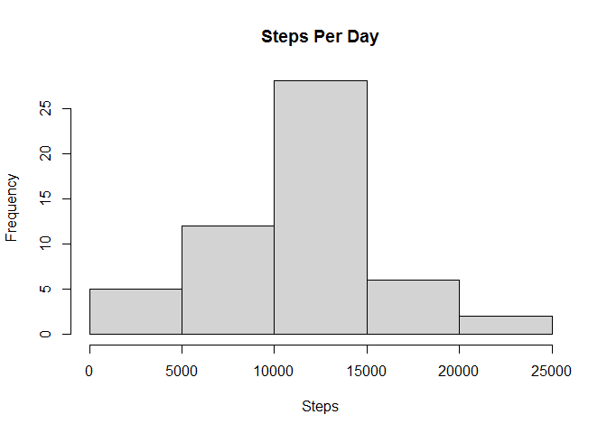

R Markdown
----------

This is an R Markdown document. Markdown is a simple formatting syntax
for authoring HTML, PDF, and MS Word documents. For more details on
using R Markdown see
<a href="http://rmarkdown.rstudio.com" class="uri">http://rmarkdown.rstudio.com</a>.

Loading and preprocessing the data
----------------------------------

    activity_data <- read.csv(unz("activity.zip", "activity.csv"))

Calculate the total number of steps taken per day
-------------------------------------------------

    totalStep <- aggregate(steps ~ date, activity_data, sum)
    hist(totalStep$steps, main = "Steps Per Day", xlab="Steps")

Calculate the mean and median of the total number of steps taken per day
------------------------------------------------------------------------

    mean(totalStep$steps)

    ## [1] 10766.19

    median(totalStep$steps)

    ## [1] 10765

Average daily activity pattern
------------------------------

    stepInterval <- aggregate(steps ~ interval, activity_data, mean)
    plot(stepInterval$interval, stepInterval$steps, type = 'l', xlab = '5-Minute Interval', 
      ylab = 'Average Number of Steps', main = 'Averaged Across All Days')

Maximum number of steps in 5-minute interval
--------------------------------------------

    stepInterval$interval[which.max(stepInterval$steps)]

    ## [1] 835

Calculate the total number of missing values in the dataset
-----------------------------------------------------------

    nrow(activity_data[is.na(activity_data$steps),])

    ## [1] 2304

Replace NAs with the mean of daily steps
----------------------------------------

    activity_data$steps[is.na(activity_data$steps)] <- mean(activity_data$steps[!is.na(activity_data$steps)])

Calculate the total number of steps taken per day
-------------------------------------------------

    totalStep <- aggregate(steps ~ date, activity_data, sum)
    hist(totalStep$steps, main = "Steps Per Day", xlab="Steps")

Calculate the mean and median of the total number of steps taken per day
------------------------------------------------------------------------

    mean(totalStep$steps)

    ## [1] 10766.19

    median(totalStep$steps)

    ## [1] 10766.19

Create a new factor variable in the dataset with two levels – “weekday” and “weekend”
-------------------------------------------------------------------------------------

    WeekLevels <- function(date) {
        if(weekdays(as.Date(date)) %in% c("Saturday", "Sunday")) {
            day <- "Weekend"
        } else {
            day <- "Weekday"
        }
    }
    activity_data$WeekLevels <- as.factor(sapply(activity_data$date, WeekLevels))

Make a panel plot
-----------------

    weekdaysData <- activity_data[activity_data$WeekLevels == "Weekday",]
    weekendsData <- activity_data[activity_data$WeekLevels == "Weekend",]
    stepsIntervalWeekdays <- aggregate(steps ~ interval, weekdaysData, mean)
    stepsIntervalWeekends <- aggregate(steps ~ interval, weekendsData, mean)

    par(mfrow = c(2, 1))

    plot(stepsIntervalWeekdays, type = "l", col = "green", xlab = "5-minute interval", ylab="Average Number of Steps", main = "Weekdays")
    plot(stepsIntervalWeekends, type = "l", col = "red", xlab = "5-minute interval", ylab="Average Number of Steps", main = "Weekends")

